# Redes Neurais Artificiais

As Redes Neurais Artificiais (RNAs) são um subconjunto dentro do grande conjunto de Machine Learning. As Redes Neurais conseguem ter um desempenho melhor para problemas mais complexos, se comparado com Árvore de Decisão, Support Vector Machine e outros. Elas são usadas em diferentes aplicações, tais como carros autônomos, tratamento de mídias (imagem, áudio e vídeo) etc.

## História

As Redes Neurais (RNs) foram conebidas em 1943 por **Warren McClulloch** (neurocientistaa) e **Walter Pitts** (matemático), quando descreveram no artigo [*A logical calculus of the ideas immanent in nervous activity*](https://www.cs.cmu.edu/~./epxing/Class/10715/reading/McCulloch.and.Pitts.pdf) o funcionamento dos neurônios por meio de modelagem matemática. 

O artigo descreve o funcionamento da atividade neural e demonstra que, a partir de suas características, é possível reproduzi-lo em uma estrutura lógica proposicional. Desse modo, Warren e Walter explicaram o comportamento de redes neurais humanas por meio de expressões lógicas.

Todo o estudo descrito por esses pesquisadores envolve discussões e suposições neurofisiológicas teóricas bem como a aplicação matemática. O artigo desencadeou muitos estudos focados na área e um maior desenvolvimento em arquiteturas neurais. 

## Funcionamento de um Neurônio

Um neurônio é composto por 4 partes: dentritos, corpo celular, axônio e terminais sinápticos.

- **Dentritos**: funcionam similar a uma porta, ou seja, é o local que receberá os sinais;
- **Corpo Celular**: processa os sinais recebidos pelos dentritos;
- **Axônio**: canal para transmitir os sinais;
- **Terminais Sinápticos**: permite a comunicação com outros neurônios.

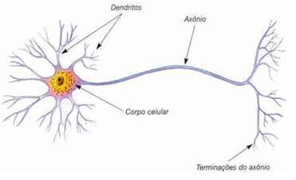

## Funcionamento de um Neurônio Artificial

- **Entrada de dados**: similar aos dentritos;
- **Processamento dos dados** similar ao corpo celular;
- **Saída dos dados**: similar aos terminais sinápticos.

## Perceptron

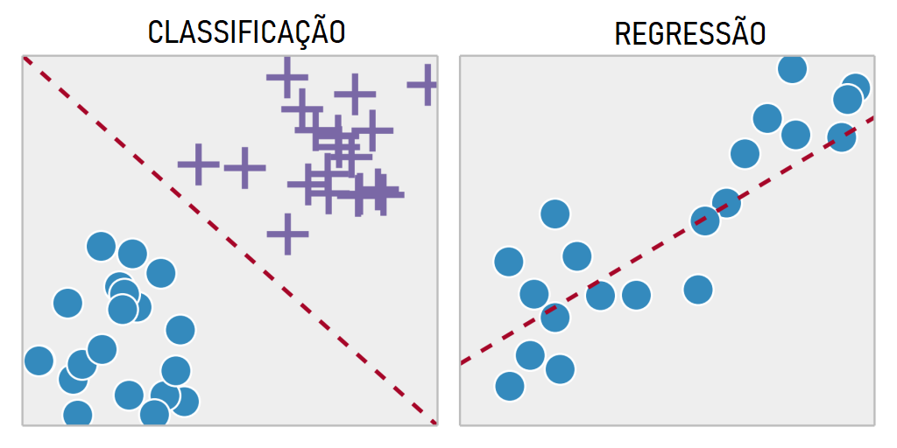

Considerando o modelo de classificação, **Frank Rosenblatt** resolveu este problema por meio do desenvolvimento de uma arquitetura computacional denominada **perceptron**, baseada no neurônio biológico, permitindo o aprendizado de máquina. Frank é considerando o pai do **Deep Learning.**

O **perceptron** é a unidade básica para a construção de uma rede neural. Ele é um modelo neural que associa pesos às entradas do modelo.

Um perceptron (ou neurônio artifical) é composto por 5 partes (camadas):

1. **Entradas**: os dados que serão processados;
1. **Pesos**: pesos associados às entradas;
1. **Bias**: é uma constate que vai adicionar um viés no cálculo do aprendizado do modelo. Importante para a construção da reta de separação;
1. **Soma**: vai executar a ponderação entre os dados e pesos;
1. **Ativação**: função de ativação que receberá os dados para gerar uma saída;
1. **Saída**: resultado final da classificação.

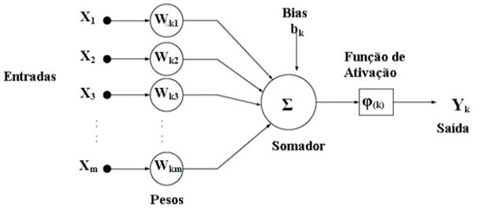

O aprendizado acontece nas funções de **Soma e Ativação**. Em conjunto, elas alteram os valores dos pesos e do bias, afim de traçar uma reta que consiga separar os elementos, possibilitando a classificação.

A função soma no perceptron tem muita ligação com a formação da reta de separação e que pode ser explicada matematicamente em um plano linear 2D.

O modelo matemático linear representa a função soma, que recebe N valores de entrada, se expressa da seguinte forma:

$$\Sigma = x_1 \times w_1 + x_2 \times w_2 + \ldots + x_n \times w_n$$

Representando esse modelo para que ele receba dois valores de entrada, teremos a seguinte equação:

$$\Sigma = x_1 \times w_1 + x_2 \times w_2$$

Ao igualar o sinal de soma à zero, pode-se isolar o valor de $x_2$ para obter uma equação da reta:

$$x_1 \times w_1 + x_2 \times w_2 = 0$$
$$x_2 \times w_2 = -x_1 \times w_1$$
$$x_2 = - \frac{x_1 \times w_1}{w_2}$$

Exemplo: $x_1 = 0, x_1 = 4, x_1 = 8$

Considerando $w_1$ e $w_2$ constantes na equação, temos então uma equação de primeira ordem centrada na origem, de modo que a alteração dos valores de $w_1$ e $w_2$ irão apenas rotacionar a reta, como mostrado no gráfico:

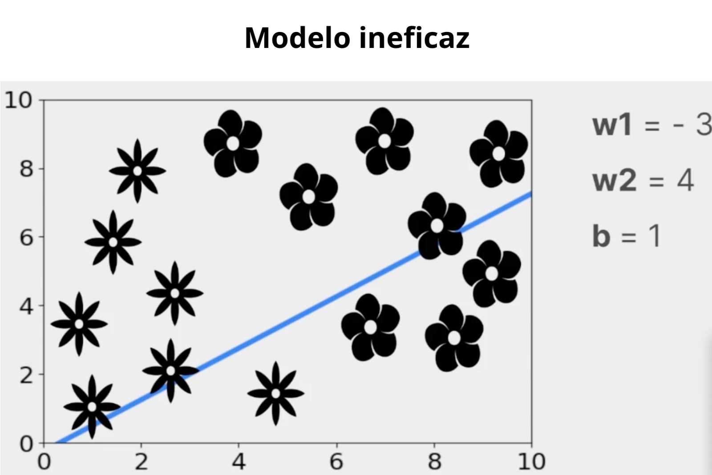

 
Para tirar a reta da origem, precisa-se adicionar um viés, ou bias, ao final da equação soma como uma constante:

$$\Sigma = x_1 \times w_1 + x_2 \times w_2 + b$$

Isolando novamente $w_2$, tem-se como resultado uma equação de 1° grau que poderá ser movida da origem.

$$x_1 \times w_1 + x_2 \times w_2 + b = 0$$
$$x_2 \times w_2 = -x_1 \times w_1 - b$$
$$x_2 = - \frac{x_1 \times w_1}{w_2} - \frac{b}{w_2}$$

Como resultado, ao otimizar os valores de pesos e bias, uma reta será capaz de dividir o plano de dados por suas classes.

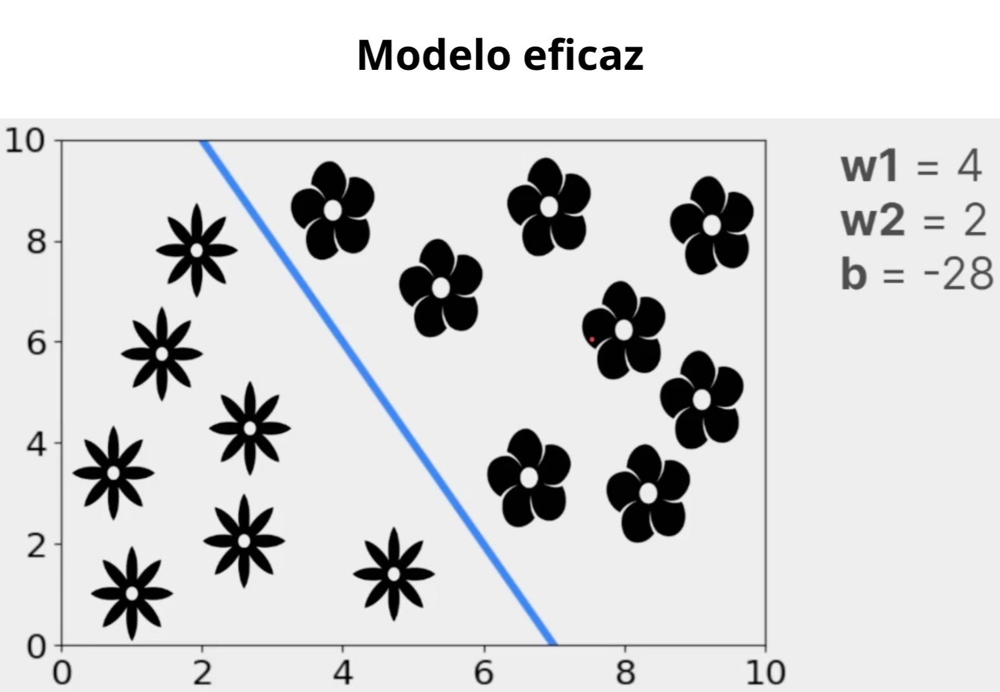

Se considerarmos $x_2$ como $y$ e $x_1$ como $x$, pode-se encontrar a equação da reta:

$$y = -x \times \frac{w_1}{w_2} - \frac{b}{w_2}$$

Exemplo: $x_1 = 0, x_1 = 5, x_1 = 7$

## Inverno da IA

Perceptron são ótimos para resolver problemas linerares (linha reta), mas não conseguem para resolver problemas não lineares. 

O **perceptron** pode ser visulizado com a tabela da porta lógica AND. Nela, conseguimos traçar uma reta e separar as classes.

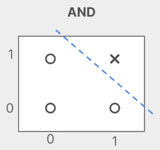

Contudo, problemas não lineares podem ser vistos como a porta lógica XOR, como pode ser visto nas figuras abaixo. Nesta situação é impossível classificar corretamente as classes. 

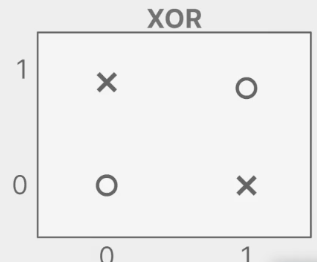
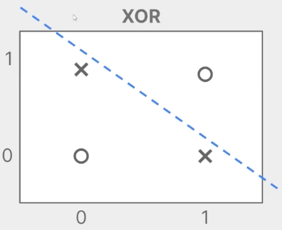
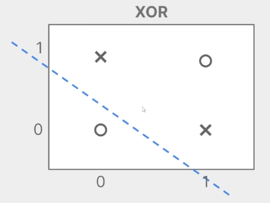

O correto seria um jeito de *"envolver"* as classes corretamente, como apresentado na figura a seguir. 

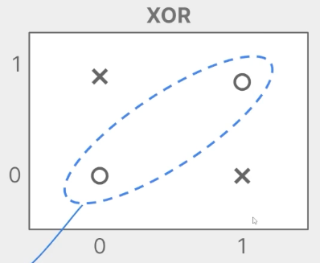

Porém, para chegar nesta solução, a área de IA ficou congelada de 1969 até 1986, conhecida como o **Inverso da IA**. Em 1986, Geoffrey Hinton encontrou uma solução não linear, denominado **Multi-Layer Perceptron (MLP)**. 

## Multi-Layer Perceptron (MLP)

Basicamente, a solução do MLP é baseada no acréscimo de múltiplas camadas, como exemplificado na figura abaixo.

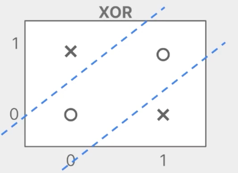

De forma feral, MLP é um conjunto de perceptrons que são organizados em uma camada oculta. A figura abaixo representa essa situação. Os círculos verdes representam os dados que serão treinados. Cada dado com seu respectivo peso é enviado para um perceptron da camada oculta (círculos azuis). Cada percetron realiza o cálulo da soma (multiplicação dos dados pelos pesos e a soma do bias) e da função de ativação. Note que cada perceptron tem um valor de bias. A saída de um perceptron é a entrada de outro perceptron da camada seguinte. 

Esse processo de envio dos dados pelos pesos, cálculo das somas ponderadas, adição dos bias e aplicação da função de ativação é chamado de **forward propagation**. Nele, a informação "*flui para frente*" pela rede, camada a camada, até gerar a saída final. Após a saída ser calculada, compara-se esse valor com a saída desejada (rótulo verdadeiro) para medir o erro. Em seguida, por meio do processo de **back propagation**, o erro é propagado no sentido contrário, da saída para as camadas anteriores, calculando gradientes que indicam como os pesos e bias devem ser ajustados. Com base nesses gradientes, a rede atualiza seus parâmetros usando métodos como o gradiente descendente, permitindo que o modelo aprenda a melhorar suas previsões a cada iteração. Confira abaixo como funciona:

### Tipo de Funções de Ativação

Na MLP, todas os neurônios devem possuir a mesma função de ativação. Abaixo, são apresentados os principais tipos de funções de ativação:

- Sigmoid (sigmóid / logística);
- ReLU (unidade linear retificada);
- Softmax.

#### Sigmoid

Seu objetivo é transformar qualquer valor real em um valor entre $0$ e $1$, interpretável como probabilidade. Sua fórmula é dada como 

$$\phi(x) = \frac{1}{1+e^{-x}} \text{,}$$

sendo $x$ o resultado da função soma ($\Sigma$).

Pode ser usada tanto na camada de saída (quando o problema é de classificação binária) ou na camada oculta (usada hoje).

Exemplos de uso:
- Classificação binária: detectar se um e-mail é spam (1) ou não spam (0);
- Modelos de risco: prever a chance de inadimplência de um cliente (risco de crédito);
- Redes neurais muito antigas: antes da popularização da ReLU.

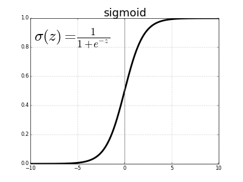

#### Rectified Linear Unit (ReLU)  

Seu objetivo é acelerar o treinamento e possui um processamento mais leve, devido ao poder de apagar alguns neurônios. Se um valor é menor ou igual a $0$, ele retorna $0$. Caso contrário, retona o próprio valor. Ela pode ser representada como

$$\phi(x) = \left\{ \begin{array}{l} 0  \text{, } x \leq 0 \\ x \text{, } x > 0 \end{array} \right\} \text{.}$$

Ela é mais utilizada praticamente em todas as redes profundas na camada oculta. Não utilizada na camada de saída. 

Exemplos de uso:
- Redes profundas modernas: reconhecimento de imagem com CNNs (Convolutional Neural Networks);
- Modelos de processamento de linguagem natural: camadas ocultas de Transformers;
- Qualquer rede neural densa moderna: previsão de séries temporais (demanda de produtos, temperatura).

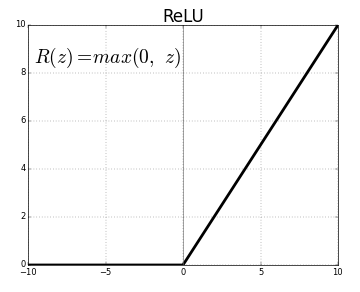

#### Softmax

A Softmax funciona como uma generalização da função sigmoid e ela transforma um vetor de valores reais em uma distribuição de probabilidade (valores entre $0$ e $1$ que somam 1). Utilizada em problemas multiclasses, ou seja, além de classificação binária. Portanto, ela é utilizada somente na camada de saída. Sua fórmula é dada como

$$\phi_i = \frac{e^{z_i}}{\Sigma_{j}e^{z_j}}\text{.}$$

Exemplos de uso:
- Classificação multiclasse: identificar qual objeto aparece em uma foto (cachorro, gato, cavalo, etc.).
- Modelos de recomendação: prever qual produto o cliente tem maior chance de clicar.
- Jogos com redes neurais: escolher o melhor movimento possível em um tabuleiro (redes de decisão em jogos).

